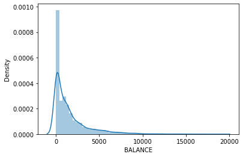
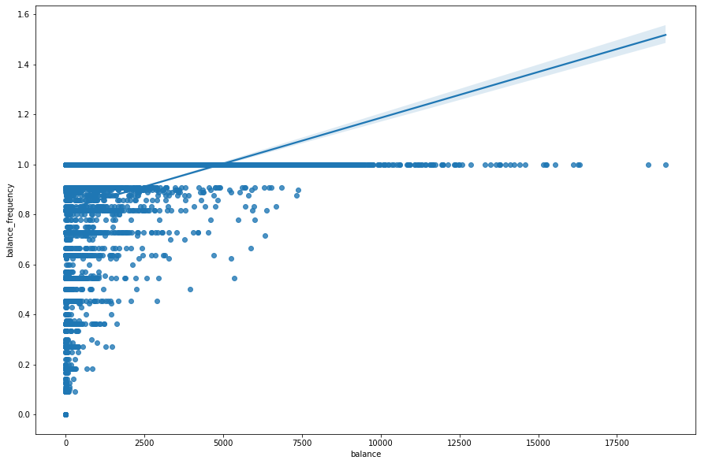
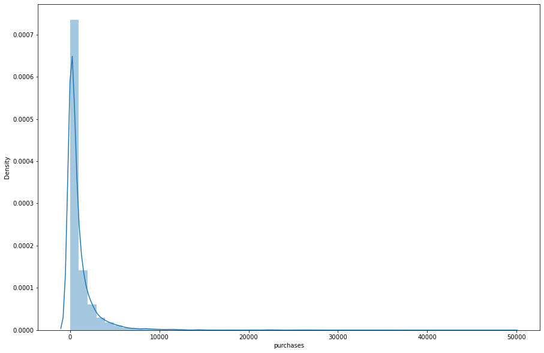
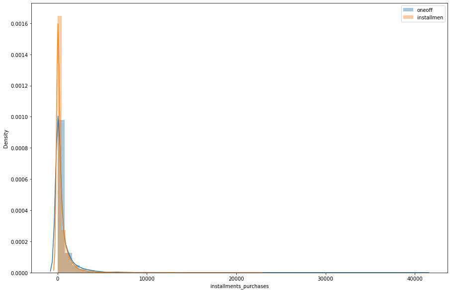

# Credit Card Market Segmentation Case Study

### Problem Statement

credit cards company just hired a data scientist to help them construct customers segments in order to customize, personalize ads and offers and understand their customers better. 

And in this repository i'll help solving this case study by building Hierarchical Clustering model.


### Dataset Information

The dataset constructs of 8950 rows and 18 columns.

#### Features Description

- Cust_id : unique identifier of the customers
- Balance : Credit card Balance
- balance frequency : how frequent the balance is
- Purchases : the amount of purchases.
- Purchases frequency : how frequent the purchases is
- oneoff purchases : the purchases done one time.
- installments purchases : purchases done by installments.
- cash_advance : the amount of money paid in advance.
- ONEOFF_PURCHASES_FREQUENCY : the frequency of oneoff purchases.
- PURCHASES_INSTALLMENTS_FREQUENCY : the frequency of installments purchases.
- CASH_ADVANCE_FREQUENCY : the frequency of cash advance payments.
- CASH_ADVANCE_TRX : the number of cash advance transactions.
- PURCHASES_TRX : the number of purchases transactions.
- CREDIT_LIMIT : the maximum credit limit.
- PAYMENTS : the amount of payments.
- MINIMUM_PAYMENTS : the minimum payment allowed for the customer.
- PRC_full_Payments : Payments for professional regulation commission.
- Tenure : the credit card tenure in months.

#### Data Types
we have 17 numerical variables excluding cutomer id.


## Packages Used 
```python

import pandas as pd
import numpy as np
import matplotlib.pyplot as plt
import seaborn as sns
from scipy.stats import spearmanr,pearsonr
from scipy.cluster.vq import whiten
from scipy.cluster.hierarchy import linkage,fcluster
pd.set_option("display.max_columns",None)
pd.set_option("display.max_rows",100)
%matplotlib inline
```

# Methods and techniques
- Data cleaning
- Data analysis
- Data Exploration
- Describtive Statistics
- Hypothesis Testing
- Cluster analysis
- Hierarchical Clustering
- Machine Learning


# Findings 
### Descriptive Statistics & General Insights
<div>

    .dataframe tbody tr th {
        vertical-align: top;
    }

    .dataframe thead th {
        text-align: right;
    }
</style>
<table border="1" class="dataframe">
  <thead>
    <tr style="text-align: right;">
      <th></th>
      <th>count</th>
      <th>mean</th>
      <th>std</th>
      <th>min</th>
      <th>25%</th>
      <th>50%</th>
      <th>75%</th>
      <th>max</th>
    </tr>
  </thead>
  <tbody>
    <tr>
      <th>BALANCE</th>
      <td>8950.0</td>
      <td>1564.474828</td>
      <td>2081.531879</td>
      <td>0.000000</td>
      <td>128.281915</td>
      <td>873.385231</td>
      <td>2054.140036</td>
      <td>19043.13856</td>
    </tr>
    <tr>
      <th>BALANCE_FREQUENCY</th>
      <td>8950.0</td>
      <td>0.877271</td>
      <td>0.236904</td>
      <td>0.000000</td>
      <td>0.888889</td>
      <td>1.000000</td>
      <td>1.000000</td>
      <td>1.00000</td>
    </tr>
    <tr>
      <th>PURCHASES</th>
      <td>8950.0</td>
      <td>1003.204834</td>
      <td>2136.634782</td>
      <td>0.000000</td>
      <td>39.635000</td>
      <td>361.280000</td>
      <td>1110.130000</td>
      <td>49039.57000</td>
    </tr>
    <tr>
      <th>ONEOFF_PURCHASES</th>
      <td>8950.0</td>
      <td>592.437371</td>
      <td>1659.887917</td>
      <td>0.000000</td>
      <td>0.000000</td>
      <td>38.000000</td>
      <td>577.405000</td>
      <td>40761.25000</td>
    </tr>
    <tr>
      <th>INSTALLMENTS_PURCHASES</th>
      <td>8950.0</td>
      <td>411.067645</td>
      <td>904.338115</td>
      <td>0.000000</td>
      <td>0.000000</td>
      <td>89.000000</td>
      <td>468.637500</td>
      <td>22500.00000</td>
    </tr>
    <tr>
      <th>CASH_ADVANCE</th>
      <td>8950.0</td>
      <td>978.871112</td>
      <td>2097.163877</td>
      <td>0.000000</td>
      <td>0.000000</td>
      <td>0.000000</td>
      <td>1113.821139</td>
      <td>47137.21176</td>
    </tr>
    <tr>
      <th>PURCHASES_FREQUENCY</th>
      <td>8950.0</td>
      <td>0.490351</td>
      <td>0.401371</td>
      <td>0.000000</td>
      <td>0.083333</td>
      <td>0.500000</td>
      <td>0.916667</td>
      <td>1.00000</td>
    </tr>
    <tr>
      <th>ONEOFF_PURCHASES_FREQUENCY</th>
      <td>8950.0</td>
      <td>0.202458</td>
      <td>0.298336</td>
      <td>0.000000</td>
      <td>0.000000</td>
      <td>0.083333</td>
      <td>0.300000</td>
      <td>1.00000</td>
    </tr>
    <tr>
      <th>PURCHASES_INSTALLMENTS_FREQUENCY</th>
      <td>8950.0</td>
      <td>0.364437</td>
      <td>0.397448</td>
      <td>0.000000</td>
      <td>0.000000</td>
      <td>0.166667</td>
      <td>0.750000</td>
      <td>1.00000</td>
    </tr>
    <tr>
      <th>CASH_ADVANCE_FREQUENCY</th>
      <td>8950.0</td>
      <td>0.135144</td>
      <td>0.200121</td>
      <td>0.000000</td>
      <td>0.000000</td>
      <td>0.000000</td>
      <td>0.222222</td>
      <td>1.50000</td>
    </tr>
    <tr>
      <th>CASH_ADVANCE_TRX</th>
      <td>8950.0</td>
      <td>3.248827</td>
      <td>6.824647</td>
      <td>0.000000</td>
      <td>0.000000</td>
      <td>0.000000</td>
      <td>4.000000</td>
      <td>123.00000</td>
    </tr>
    <tr>
      <th>PURCHASES_TRX</th>
      <td>8950.0</td>
      <td>14.709832</td>
      <td>24.857649</td>
      <td>0.000000</td>
      <td>1.000000</td>
      <td>7.000000</td>
      <td>17.000000</td>
      <td>358.00000</td>
    </tr>
    <tr>
      <th>CREDIT_LIMIT</th>
      <td>8949.0</td>
      <td>4494.449450</td>
      <td>3638.815725</td>
      <td>50.000000</td>
      <td>1600.000000</td>
      <td>3000.000000</td>
      <td>6500.000000</td>
      <td>30000.00000</td>
    </tr>
    <tr>
      <th>PAYMENTS</th>
      <td>8950.0</td>
      <td>1733.143852</td>
      <td>2895.063757</td>
      <td>0.000000</td>
      <td>383.276166</td>
      <td>856.901546</td>
      <td>1901.134317</td>
      <td>50721.48336</td>
    </tr>
    <tr>
      <th>MINIMUM_PAYMENTS</th>
      <td>8637.0</td>
      <td>864.206542</td>
      <td>2372.446607</td>
      <td>0.019163</td>
      <td>169.123707</td>
      <td>312.343947</td>
      <td>825.485459</td>
      <td>76406.20752</td>
    </tr>
    <tr>
      <th>PRC_FULL_PAYMENT</th>
      <td>8950.0</td>
      <td>0.153715</td>
      <td>0.292499</td>
      <td>0.000000</td>
      <td>0.000000</td>
      <td>0.000000</td>
      <td>0.142857</td>
      <td>1.00000</td>
    </tr>
    <tr>
      <th>TENURE</th>
      <td>8950.0</td>
      <td>11.517318</td>
      <td>1.338331</td>
      <td>6.000000</td>
      <td>12.000000</td>
      <td>12.000000</td>
      <td>12.000000</td>
      <td>12.00000</td>
    </tr>
  </tbody>
</table>
</div>

- The average balance is 1560
- The average balance frequency is high which means that we have a high purchase customers
- the average purchases is 1000$ and there's a lot of diversity in it
- the one time purchases average more than the installment average
- more than 75% of the customers don't have advance cash
- the credit limit average is near 4500 $
- more than 75% of tenure is 12
- minimum payments is 850 $


### Balance 


    


- the customers balances are between 0 and 3000


### Balance Frequency and Balance Correlation



```python
# Spearman correlation

from scipy.stats import spearmanr,pearsonr

spearmanr(df["balance"],df["balance_frequency"])

```


    SpearmanrResult(correlation=0.544980971507205, pvalue=0.0)

- There's a strong correlation between balance frequency and balance.


### Purchases


    


- Most purchases is less than 10000 $ 


### oneoff vs installment purchases


```python
plt.figure(figsize=(15,10))
sns.distplot(df["oneoff_purchases"],label="oneoff")
sns.distplot(df["installments_purchases"],label="installment")
plt.title("Distribution of installment and oneoff purchases")
plt.legend()
```


- The installments purchases are more than oneoff purchases
