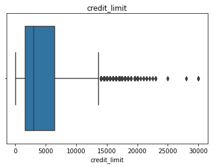

# Credit-Card-Market-Segmentation-Project
Clustering data science project where I built a hierarchical clustering model to find patterns in data, and build customer segments based on their behavior.


```python

import pandas as pd
import numpy as np
import matplotlib.pyplot as plt
import seaborn as sns
pd.set_option("display.max_columns",None)
pd.set_option("display.max_rows",100)
%matplotlib inline
```


```python
df = pd.read_csv("Customer Data.csv")
```

## Data Understanding


```python
df.info()
```

    <class 'pandas.core.frame.DataFrame'>
    RangeIndex: 8950 entries, 0 to 8949
    Data columns (total 18 columns):
     #   Column                            Non-Null Count  Dtype  
    ---  ------                            --------------  -----  
     0   CUST_ID                           8950 non-null   object 
     1   BALANCE                           8950 non-null   float64
     2   BALANCE_FREQUENCY                 8950 non-null   float64
     3   PURCHASES                         8950 non-null   float64
     4   ONEOFF_PURCHASES                  8950 non-null   float64
     5   INSTALLMENTS_PURCHASES            8950 non-null   float64
     6   CASH_ADVANCE                      8950 non-null   float64
     7   PURCHASES_FREQUENCY               8950 non-null   float64
     8   ONEOFF_PURCHASES_FREQUENCY        8950 non-null   float64
     9   PURCHASES_INSTALLMENTS_FREQUENCY  8950 non-null   float64
     10  CASH_ADVANCE_FREQUENCY            8950 non-null   float64
     11  CASH_ADVANCE_TRX                  8950 non-null   int64  
     12  PURCHASES_TRX                     8950 non-null   int64  
     13  CREDIT_LIMIT                      8949 non-null   float64
     14  PAYMENTS                          8950 non-null   float64
     15  MINIMUM_PAYMENTS                  8637 non-null   float64
     16  PRC_FULL_PAYMENT                  8950 non-null   float64
     17  TENURE                            8950 non-null   int64  
    dtypes: float64(14), int64(3), object(1)
    memory usage: 1.2+ MB
    

- there's a null values, which will be handled later.


```python
df.columns
```


    Index(['balance', 'balance_frequency', 'purchases', 'oneoff_purchases',
           'installments_purchases', 'cash_advance', 'purchases_frequency',
           'oneoff_purchases_frequency', 'purchases_installments_frequency',
           'cash_advance_frequency', 'cash_advance_trx', 'purchases_trx',
           'credit_limit', 'payments', 'minimum_payments', 'prc_full_payment',
           'tenure'],
          dtype='object')


```python
# Convert Columns to lowercase
lower = [x.lower() for x in df.columns]
df.columns = lower
# Remove unnecessary column
df = df.drop("cust_id")
```


```python
# Visualize data structure
df.head()
```


<div>
<style scoped>
    .dataframe tbody tr th:only-of-type {
        vertical-align: middle;
    }

    .dataframe tbody tr th {
        vertical-align: top;
    }

    .dataframe thead th {
        text-align: right;
    }
</style>
<table border="1" class="dataframe">
  <thead>
    <tr style="text-align: right;">
      <th></th>
      <th>cust_id</th>
      <th>balance</th>
      <th>balance_frequency</th>
      <th>purchases</th>
      <th>oneoff_purchases</th>
      <th>installments_purchases</th>
      <th>cash_advance</th>
      <th>purchases_frequency</th>
      <th>oneoff_purchases_frequency</th>
      <th>purchases_installments_frequency</th>
      <th>cash_advance_frequency</th>
      <th>cash_advance_trx</th>
      <th>purchases_trx</th>
      <th>credit_limit</th>
      <th>payments</th>
      <th>minimum_payments</th>
      <th>prc_full_payment</th>
      <th>tenure</th>
    </tr>
  </thead>
  <tbody>
    <tr>
      <th>0</th>
      <td>C10001</td>
      <td>40.900749</td>
      <td>0.818182</td>
      <td>95.40</td>
      <td>0.00</td>
      <td>95.4</td>
      <td>0.000000</td>
      <td>0.166667</td>
      <td>0.000000</td>
      <td>0.083333</td>
      <td>0.000000</td>
      <td>0</td>
      <td>2</td>
      <td>1000.0</td>
      <td>201.802084</td>
      <td>139.509787</td>
      <td>0.000000</td>
      <td>12</td>
    </tr>
    <tr>
      <th>1</th>
      <td>C10002</td>
      <td>3202.467416</td>
      <td>0.909091</td>
      <td>0.00</td>
      <td>0.00</td>
      <td>0.0</td>
      <td>6442.945483</td>
      <td>0.000000</td>
      <td>0.000000</td>
      <td>0.000000</td>
      <td>0.250000</td>
      <td>4</td>
      <td>0</td>
      <td>7000.0</td>
      <td>4103.032597</td>
      <td>1072.340217</td>
      <td>0.222222</td>
      <td>12</td>
    </tr>
    <tr>
      <th>2</th>
      <td>C10003</td>
      <td>2495.148862</td>
      <td>1.000000</td>
      <td>773.17</td>
      <td>773.17</td>
      <td>0.0</td>
      <td>0.000000</td>
      <td>1.000000</td>
      <td>1.000000</td>
      <td>0.000000</td>
      <td>0.000000</td>
      <td>0</td>
      <td>12</td>
      <td>7500.0</td>
      <td>622.066742</td>
      <td>627.284787</td>
      <td>0.000000</td>
      <td>12</td>
    </tr>
    <tr>
      <th>3</th>
      <td>C10004</td>
      <td>1666.670542</td>
      <td>0.636364</td>
      <td>1499.00</td>
      <td>1499.00</td>
      <td>0.0</td>
      <td>205.788017</td>
      <td>0.083333</td>
      <td>0.083333</td>
      <td>0.000000</td>
      <td>0.083333</td>
      <td>1</td>
      <td>1</td>
      <td>7500.0</td>
      <td>0.000000</td>
      <td>NaN</td>
      <td>0.000000</td>
      <td>12</td>
    </tr>
    <tr>
      <th>4</th>
      <td>C10005</td>
      <td>817.714335</td>
      <td>1.000000</td>
      <td>16.00</td>
      <td>16.00</td>
      <td>0.0</td>
      <td>0.000000</td>
      <td>0.083333</td>
      <td>0.083333</td>
      <td>0.000000</td>
      <td>0.000000</td>
      <td>0</td>
      <td>1</td>
      <td>1200.0</td>
      <td>678.334763</td>
      <td>244.791237</td>
      <td>0.000000</td>
      <td>12</td>
    </tr>
  </tbody>
</table>
</div>


```python
# Dataset Dimensions
print(f"Dataset has {df.shape[0]} rows, and {df.shape[1]} columns.")
```

    Dataset has 8950 rows, and 18 columns.
    


```python
# Create a copy to not ruin the training data
df_copy = df.copy()
```


```python
# drop useless columns
df = df.drop("cust_id",axis=1)
```


    ---------------------------------------------------------------------------

    KeyError                                  Traceback (most recent call last)

    c:\Users\Data Scientist\Desktop\Clustring Project\Code.ipynb Cell 11 in <cell line: 2>()
          <a href='vscode-notebook-cell:/c%3A/Users/Data%20Scientist/Desktop/Clustring%20Project/Code.ipynb#X15sZmlsZQ%3D%3D?line=0'>1</a> # drop useless columns
    ----> <a href='vscode-notebook-cell:/c%3A/Users/Data%20Scientist/Desktop/Clustring%20Project/Code.ipynb#X15sZmlsZQ%3D%3D?line=1'>2</a> df = df.drop("cust_id",axis=1)
    

    File c:\ProgramData\Anaconda3\lib\site-packages\pandas\util\_decorators.py:311, in deprecate_nonkeyword_arguments.<locals>.decorate.<locals>.wrapper(*args, **kwargs)
        305 if len(args) > num_allow_args:
        306     warnings.warn(
        307         msg.format(arguments=arguments),
        308         FutureWarning,
        309         stacklevel=stacklevel,
        310     )
    --> 311 return func(*args, **kwargs)
    

    File c:\ProgramData\Anaconda3\lib\site-packages\pandas\core\frame.py:4954, in DataFrame.drop(self, labels, axis, index, columns, level, inplace, errors)
       4806 @deprecate_nonkeyword_arguments(version=None, allowed_args=["self", "labels"])
       4807 def drop(
       4808     self,
       (...)
       4815     errors: str = "raise",
       4816 ):
       4817     """
       4818     Drop specified labels from rows or columns.
       4819 
       (...)
       4952             weight  1.0     0.8
       4953     """
    -> 4954     return super().drop(
       4955         labels=labels,
       4956         axis=axis,
       4957         index=index,
       4958         columns=columns,
       4959         level=level,
       4960         inplace=inplace,
       4961         errors=errors,
       4962     )
    

    File c:\ProgramData\Anaconda3\lib\site-packages\pandas\core\generic.py:4267, in NDFrame.drop(self, labels, axis, index, columns, level, inplace, errors)
       4265 for axis, labels in axes.items():
       4266     if labels is not None:
    -> 4267         obj = obj._drop_axis(labels, axis, level=level, errors=errors)
       4269 if inplace:
       4270     self._update_inplace(obj)
    

    File c:\ProgramData\Anaconda3\lib\site-packages\pandas\core\generic.py:4311, in NDFrame._drop_axis(self, labels, axis, level, errors, consolidate, only_slice)
       4309         new_axis = axis.drop(labels, level=level, errors=errors)
       4310     else:
    -> 4311         new_axis = axis.drop(labels, errors=errors)
       4312     indexer = axis.get_indexer(new_axis)
       4314 # Case for non-unique axis
       4315 else:
    

    File c:\ProgramData\Anaconda3\lib\site-packages\pandas\core\indexes\base.py:6644, in Index.drop(self, labels, errors)
       6642 if mask.any():
       6643     if errors != "ignore":
    -> 6644         raise KeyError(f"{list(labels[mask])} not found in axis")
       6645     indexer = indexer[~mask]
       6646 return self.delete(indexer)
    

    KeyError: "['cust_id'] not found in axis"


- Drop NaNs


df = df.dropna()

### Descriptive Statistics


```python
df.describe().T
```


<div>
<style scoped>
    .dataframe tbody tr th:only-of-type {
        vertical-align: middle;
    }

    .dataframe tbody tr th {
        vertical-align: top;
    }

    .dataframe thead th {
        text-align: right;
    }
</style>
<table border="1" class="dataframe">
  <thead>
    <tr style="text-align: right;">
      <th></th>
      <th>count</th>
      <th>mean</th>
      <th>std</th>
      <th>min</th>
      <th>25%</th>
      <th>50%</th>
      <th>75%</th>
      <th>max</th>
    </tr>
  </thead>
  <tbody>
    <tr>
      <th>BALANCE</th>
      <td>8950.0</td>
      <td>1564.474828</td>
      <td>2081.531879</td>
      <td>0.000000</td>
      <td>128.281915</td>
      <td>873.385231</td>
      <td>2054.140036</td>
      <td>19043.13856</td>
    </tr>
    <tr>
      <th>BALANCE_FREQUENCY</th>
      <td>8950.0</td>
      <td>0.877271</td>
      <td>0.236904</td>
      <td>0.000000</td>
      <td>0.888889</td>
      <td>1.000000</td>
      <td>1.000000</td>
      <td>1.00000</td>
    </tr>
    <tr>
      <th>PURCHASES</th>
      <td>8950.0</td>
      <td>1003.204834</td>
      <td>2136.634782</td>
      <td>0.000000</td>
      <td>39.635000</td>
      <td>361.280000</td>
      <td>1110.130000</td>
      <td>49039.57000</td>
    </tr>
    <tr>
      <th>ONEOFF_PURCHASES</th>
      <td>8950.0</td>
      <td>592.437371</td>
      <td>1659.887917</td>
      <td>0.000000</td>
      <td>0.000000</td>
      <td>38.000000</td>
      <td>577.405000</td>
      <td>40761.25000</td>
    </tr>
    <tr>
      <th>INSTALLMENTS_PURCHASES</th>
      <td>8950.0</td>
      <td>411.067645</td>
      <td>904.338115</td>
      <td>0.000000</td>
      <td>0.000000</td>
      <td>89.000000</td>
      <td>468.637500</td>
      <td>22500.00000</td>
    </tr>
    <tr>
      <th>CASH_ADVANCE</th>
      <td>8950.0</td>
      <td>978.871112</td>
      <td>2097.163877</td>
      <td>0.000000</td>
      <td>0.000000</td>
      <td>0.000000</td>
      <td>1113.821139</td>
      <td>47137.21176</td>
    </tr>
    <tr>
      <th>PURCHASES_FREQUENCY</th>
      <td>8950.0</td>
      <td>0.490351</td>
      <td>0.401371</td>
      <td>0.000000</td>
      <td>0.083333</td>
      <td>0.500000</td>
      <td>0.916667</td>
      <td>1.00000</td>
    </tr>
    <tr>
      <th>ONEOFF_PURCHASES_FREQUENCY</th>
      <td>8950.0</td>
      <td>0.202458</td>
      <td>0.298336</td>
      <td>0.000000</td>
      <td>0.000000</td>
      <td>0.083333</td>
      <td>0.300000</td>
      <td>1.00000</td>
    </tr>
    <tr>
      <th>PURCHASES_INSTALLMENTS_FREQUENCY</th>
      <td>8950.0</td>
      <td>0.364437</td>
      <td>0.397448</td>
      <td>0.000000</td>
      <td>0.000000</td>
      <td>0.166667</td>
      <td>0.750000</td>
      <td>1.00000</td>
    </tr>
    <tr>
      <th>CASH_ADVANCE_FREQUENCY</th>
      <td>8950.0</td>
      <td>0.135144</td>
      <td>0.200121</td>
      <td>0.000000</td>
      <td>0.000000</td>
      <td>0.000000</td>
      <td>0.222222</td>
      <td>1.50000</td>
    </tr>
    <tr>
      <th>CASH_ADVANCE_TRX</th>
      <td>8950.0</td>
      <td>3.248827</td>
      <td>6.824647</td>
      <td>0.000000</td>
      <td>0.000000</td>
      <td>0.000000</td>
      <td>4.000000</td>
      <td>123.00000</td>
    </tr>
    <tr>
      <th>PURCHASES_TRX</th>
      <td>8950.0</td>
      <td>14.709832</td>
      <td>24.857649</td>
      <td>0.000000</td>
      <td>1.000000</td>
      <td>7.000000</td>
      <td>17.000000</td>
      <td>358.00000</td>
    </tr>
    <tr>
      <th>CREDIT_LIMIT</th>
      <td>8949.0</td>
      <td>4494.449450</td>
      <td>3638.815725</td>
      <td>50.000000</td>
      <td>1600.000000</td>
      <td>3000.000000</td>
      <td>6500.000000</td>
      <td>30000.00000</td>
    </tr>
    <tr>
      <th>PAYMENTS</th>
      <td>8950.0</td>
      <td>1733.143852</td>
      <td>2895.063757</td>
      <td>0.000000</td>
      <td>383.276166</td>
      <td>856.901546</td>
      <td>1901.134317</td>
      <td>50721.48336</td>
    </tr>
    <tr>
      <th>MINIMUM_PAYMENTS</th>
      <td>8637.0</td>
      <td>864.206542</td>
      <td>2372.446607</td>
      <td>0.019163</td>
      <td>169.123707</td>
      <td>312.343947</td>
      <td>825.485459</td>
      <td>76406.20752</td>
    </tr>
    <tr>
      <th>PRC_FULL_PAYMENT</th>
      <td>8950.0</td>
      <td>0.153715</td>
      <td>0.292499</td>
      <td>0.000000</td>
      <td>0.000000</td>
      <td>0.000000</td>
      <td>0.142857</td>
      <td>1.00000</td>
    </tr>
    <tr>
      <th>TENURE</th>
      <td>8950.0</td>
      <td>11.517318</td>
      <td>1.338331</td>
      <td>6.000000</td>
      <td>12.000000</td>
      <td>12.000000</td>
      <td>12.000000</td>
      <td>12.00000</td>
    </tr>
  </tbody>
</table>
</div>


### Insights

- The average balance is 1560
- The average balance frequency is high which means that we have a high purchase customers
- the average purchases is 1000$ and there's a lot of diversity in it
- the one time purchases average more than the installment average
- more than 75% of the customers don't have advance cash
- the credit limit average is near 4500 $
- more than 75% of tenure is 12
- minimum payments is 850 $


```python
# Round The number to be more human friendly
for column in df.columns:
    df[column] = df[column].round(2)
```

### Analyzing Balance


```python
# Distribution
sns.distplot(df["BALANCE"])
```

    c:\ProgramData\Anaconda3\lib\site-packages\seaborn\distributions.py:2619: FutureWarning: `distplot` is a deprecated function and will be removed in a future version. Please adapt your code to use either `displot` (a figure-level function with similar flexibility) or `histplot` (an axes-level function for histograms).
      warnings.warn(msg, FutureWarning)
    


    <AxesSubplot:xlabel='BALANCE', ylabel='Density'>


    

    


- the customers balances are between 0 and 3000

#### Customers with more than 5000 balance have near to 1 balance frequency

### Balance Frequency


```python
sns.distplot(df["BALANCE_FREQUENCY"])
plt.title("Distribution of balance frequency")
```

    c:\ProgramData\Anaconda3\lib\site-packages\seaborn\distributions.py:2619: FutureWarning: `distplot` is a deprecated function and will be removed in a future version. Please adapt your code to use either `displot` (a figure-level function with similar flexibility) or `histplot` (an axes-level function for histograms).
      warnings.warn(msg, FutureWarning)
    


    <AxesSubplot:xlabel='BALANCE_FREQUENCY', ylabel='Density'>


    

    


### What is the behaviours of customers with lower than 1 balance frequency


```python
df[df["BALANCE_FREQUENCY"] < 0.5].sample(20)
```


<div>
<style scoped>
    .dataframe tbody tr th:only-of-type {
        vertical-align: middle;
    }

    .dataframe tbody tr th {
        vertical-align: top;
    }

    .dataframe thead th {
        text-align: right;
    }
</style>
<table border="1" class="dataframe">
  <thead>
    <tr style="text-align: right;">
      <th></th>
      <th>BALANCE</th>
      <th>BALANCE_FREQUENCY</th>
      <th>PURCHASES</th>
      <th>ONEOFF_PURCHASES</th>
      <th>INSTALLMENTS_PURCHASES</th>
      <th>CASH_ADVANCE</th>
      <th>PURCHASES_FREQUENCY</th>
      <th>ONEOFF_PURCHASES_FREQUENCY</th>
      <th>PURCHASES_INSTALLMENTS_FREQUENCY</th>
      <th>CASH_ADVANCE_FREQUENCY</th>
      <th>CASH_ADVANCE_TRX</th>
      <th>PURCHASES_TRX</th>
      <th>CREDIT_LIMIT</th>
      <th>PAYMENTS</th>
      <th>MINIMUM_PAYMENTS</th>
      <th>PRC_FULL_PAYMENT</th>
      <th>TENURE</th>
    </tr>
  </thead>
  <tbody>
    <tr>
      <th>8745</th>
      <td>1000.81</td>
      <td>0.29</td>
      <td>0.00</td>
      <td>0.00</td>
      <td>0.00</td>
      <td>3465.27</td>
      <td>0.00</td>
      <td>0.00</td>
      <td>0.00</td>
      <td>0.14</td>
      <td>6</td>
      <td>0</td>
      <td>6000.0</td>
      <td>235.35</td>
      <td>460.70</td>
      <td>0.00</td>
      <td>7</td>
    </tr>
    <tr>
      <th>6570</th>
      <td>8.85</td>
      <td>0.45</td>
      <td>220.99</td>
      <td>0.00</td>
      <td>220.99</td>
      <td>0.00</td>
      <td>0.92</td>
      <td>0.00</td>
      <td>0.83</td>
      <td>0.00</td>
      <td>0</td>
      <td>11</td>
      <td>1000.0</td>
      <td>286.31</td>
      <td>52.84</td>
      <td>0.12</td>
      <td>12</td>
    </tr>
    <tr>
      <th>3861</th>
      <td>58.17</td>
      <td>0.18</td>
      <td>438.87</td>
      <td>438.87</td>
      <td>0.00</td>
      <td>0.00</td>
      <td>0.08</td>
      <td>0.08</td>
      <td>0.00</td>
      <td>0.00</td>
      <td>0</td>
      <td>1</td>
      <td>7500.0</td>
      <td>1748.47</td>
      <td>270.53</td>
      <td>0.00</td>
      <td>12</td>
    </tr>
    <tr>
      <th>1215</th>
      <td>2.55</td>
      <td>0.18</td>
      <td>322.98</td>
      <td>322.98</td>
      <td>0.00</td>
      <td>0.00</td>
      <td>0.17</td>
      <td>0.17</td>
      <td>0.00</td>
      <td>0.00</td>
      <td>0</td>
      <td>3</td>
      <td>9500.0</td>
      <td>1210.43</td>
      <td>5.46</td>
      <td>0.00</td>
      <td>12</td>
    </tr>
    <tr>
      <th>7128</th>
      <td>15.23</td>
      <td>0.27</td>
      <td>384.00</td>
      <td>0.00</td>
      <td>384.00</td>
      <td>0.00</td>
      <td>1.00</td>
      <td>0.00</td>
      <td>1.00</td>
      <td>0.00</td>
      <td>0</td>
      <td>12</td>
      <td>1500.0</td>
      <td>568.98</td>
      <td>54.45</td>
      <td>0.27</td>
      <td>12</td>
    </tr>
    <tr>
      <th>3137</th>
      <td>21.97</td>
      <td>0.45</td>
      <td>335.00</td>
      <td>0.00</td>
      <td>335.00</td>
      <td>0.00</td>
      <td>0.42</td>
      <td>0.00</td>
      <td>0.42</td>
      <td>0.00</td>
      <td>0</td>
      <td>5</td>
      <td>1000.0</td>
      <td>742.77</td>
      <td>145.14</td>
      <td>0.33</td>
      <td>12</td>
    </tr>
    <tr>
      <th>3225</th>
      <td>175.93</td>
      <td>0.33</td>
      <td>264.98</td>
      <td>0.00</td>
      <td>264.98</td>
      <td>1556.63</td>
      <td>0.22</td>
      <td>0.00</td>
      <td>0.11</td>
      <td>0.33</td>
      <td>3</td>
      <td>6</td>
      <td>1500.0</td>
      <td>5379.82</td>
      <td>153.46</td>
      <td>1.00</td>
      <td>9</td>
    </tr>
    <tr>
      <th>3563</th>
      <td>21.79</td>
      <td>0.33</td>
      <td>0.00</td>
      <td>0.00</td>
      <td>0.00</td>
      <td>273.88</td>
      <td>0.00</td>
      <td>0.00</td>
      <td>0.00</td>
      <td>0.17</td>
      <td>1</td>
      <td>0</td>
      <td>1200.0</td>
      <td>574.48</td>
      <td>30.62</td>
      <td>1.00</td>
      <td>6</td>
    </tr>
    <tr>
      <th>5412</th>
      <td>286.69</td>
      <td>0.09</td>
      <td>0.00</td>
      <td>0.00</td>
      <td>0.00</td>
      <td>3742.71</td>
      <td>0.00</td>
      <td>0.00</td>
      <td>0.00</td>
      <td>0.08</td>
      <td>2</td>
      <td>0</td>
      <td>4000.0</td>
      <td>0.00</td>
      <td>NaN</td>
      <td>0.00</td>
      <td>12</td>
    </tr>
    <tr>
      <th>8178</th>
      <td>41.39</td>
      <td>0.36</td>
      <td>194.57</td>
      <td>194.57</td>
      <td>0.00</td>
      <td>0.00</td>
      <td>0.17</td>
      <td>0.17</td>
      <td>0.00</td>
      <td>0.00</td>
      <td>0</td>
      <td>2</td>
      <td>2200.0</td>
      <td>470.43</td>
      <td>170.00</td>
      <td>0.00</td>
      <td>12</td>
    </tr>
    <tr>
      <th>914</th>
      <td>2.96</td>
      <td>0.27</td>
      <td>202.72</td>
      <td>0.00</td>
      <td>202.72</td>
      <td>0.00</td>
      <td>0.83</td>
      <td>0.00</td>
      <td>0.83</td>
      <td>0.00</td>
      <td>0</td>
      <td>10</td>
      <td>4500.0</td>
      <td>31.60</td>
      <td>53.01</td>
      <td>0.00</td>
      <td>12</td>
    </tr>
    <tr>
      <th>6971</th>
      <td>67.59</td>
      <td>0.45</td>
      <td>619.59</td>
      <td>619.59</td>
      <td>0.00</td>
      <td>0.00</td>
      <td>0.08</td>
      <td>0.08</td>
      <td>0.00</td>
      <td>0.00</td>
      <td>0</td>
      <td>1</td>
      <td>4000.0</td>
      <td>997.08</td>
      <td>93.32</td>
      <td>0.09</td>
      <td>12</td>
    </tr>
    <tr>
      <th>172</th>
      <td>23.11</td>
      <td>0.36</td>
      <td>300.00</td>
      <td>0.00</td>
      <td>300.00</td>
      <td>0.00</td>
      <td>0.25</td>
      <td>0.00</td>
      <td>0.17</td>
      <td>0.00</td>
      <td>0</td>
      <td>3</td>
      <td>12500.0</td>
      <td>291.95</td>
      <td>43.45</td>
      <td>0.18</td>
      <td>12</td>
    </tr>
    <tr>
      <th>8109</th>
      <td>16.18</td>
      <td>0.36</td>
      <td>95.55</td>
      <td>0.00</td>
      <td>95.55</td>
      <td>0.00</td>
      <td>0.25</td>
      <td>0.00</td>
      <td>0.25</td>
      <td>0.00</td>
      <td>0</td>
      <td>3</td>
      <td>1000.0</td>
      <td>136.96</td>
      <td>59.91</td>
      <td>0.00</td>
      <td>12</td>
    </tr>
    <tr>
      <th>8752</th>
      <td>0.98</td>
      <td>0.27</td>
      <td>0.00</td>
      <td>0.00</td>
      <td>0.00</td>
      <td>329.93</td>
      <td>0.00</td>
      <td>0.00</td>
      <td>0.00</td>
      <td>0.08</td>
      <td>1</td>
      <td>0</td>
      <td>500.0</td>
      <td>1316.75</td>
      <td>1.72</td>
      <td>1.00</td>
      <td>12</td>
    </tr>
    <tr>
      <th>7260</th>
      <td>28.16</td>
      <td>0.45</td>
      <td>324.17</td>
      <td>0.00</td>
      <td>324.17</td>
      <td>0.00</td>
      <td>0.42</td>
      <td>0.00</td>
      <td>0.42</td>
      <td>0.00</td>
      <td>0</td>
      <td>5</td>
      <td>1500.0</td>
      <td>354.51</td>
      <td>84.00</td>
      <td>0.40</td>
      <td>12</td>
    </tr>
    <tr>
      <th>5828</th>
      <td>323.80</td>
      <td>0.33</td>
      <td>0.00</td>
      <td>0.00</td>
      <td>0.00</td>
      <td>1430.49</td>
      <td>0.00</td>
      <td>0.00</td>
      <td>0.00</td>
      <td>0.17</td>
      <td>1</td>
      <td>0</td>
      <td>1500.0</td>
      <td>0.00</td>
      <td>NaN</td>
      <td>0.00</td>
      <td>6</td>
    </tr>
    <tr>
      <th>5292</th>
      <td>2.59</td>
      <td>0.09</td>
      <td>70.00</td>
      <td>70.00</td>
      <td>0.00</td>
      <td>0.00</td>
      <td>0.08</td>
      <td>0.08</td>
      <td>0.00</td>
      <td>0.00</td>
      <td>0</td>
      <td>1</td>
      <td>2000.0</td>
      <td>396.44</td>
      <td>85.07</td>
      <td>0.00</td>
      <td>12</td>
    </tr>
    <tr>
      <th>4705</th>
      <td>5.34</td>
      <td>0.27</td>
      <td>57.00</td>
      <td>0.00</td>
      <td>57.00</td>
      <td>0.00</td>
      <td>0.25</td>
      <td>0.00</td>
      <td>0.17</td>
      <td>0.00</td>
      <td>0</td>
      <td>3</td>
      <td>5000.0</td>
      <td>164.04</td>
      <td>124.16</td>
      <td>1.00</td>
      <td>12</td>
    </tr>
    <tr>
      <th>5507</th>
      <td>1222.75</td>
      <td>0.36</td>
      <td>0.00</td>
      <td>0.00</td>
      <td>0.00</td>
      <td>5396.55</td>
      <td>0.00</td>
      <td>0.00</td>
      <td>0.00</td>
      <td>0.08</td>
      <td>1</td>
      <td>0</td>
      <td>6000.0</td>
      <td>15843.68</td>
      <td>1261.13</td>
      <td>0.33</td>
      <td>12</td>
    </tr>
  </tbody>
</table>
</div>


- Customer with lower balance frequency tend to have more purchases

#### Relationship between balance and balance frequency:


```python
# Creating a Regrission plot
plt.figure(figsize=(15,10))
sns.regplot(df["balance"],df["balance_frequency"])
plt.title("Regression plot balance vs balance frequency")
```

    c:\ProgramData\Anaconda3\lib\site-packages\seaborn\_decorators.py:36: FutureWarning: Pass the following variables as keyword args: x, y. From version 0.12, the only valid positional argument will be `data`, and passing other arguments without an explicit keyword will result in an error or misinterpretation.
      warnings.warn(
    


    <AxesSubplot:xlabel='balance', ylabel='balance_frequency'>


    

    


```python
# Spearman correlation

from scipy.stats import spearmanr,pearsonr

spearmanr(df["balance"],df["balance_frequency"])

```


    SpearmanrResult(correlation=0.544980971507205, pvalue=0.0)


- There's a strong correlation between balance frequency and balance.


```python
sns.violinplot(df["balance"])
plt.title("Balance Distribution")
```

    c:\ProgramData\Anaconda3\lib\site-packages\seaborn\_decorators.py:36: FutureWarning: Pass the following variable as a keyword arg: x. From version 0.12, the only valid positional argument will be `data`, and passing other arguments without an explicit keyword will result in an error or misinterpretation.
      warnings.warn(
    


    <AxesSubplot:xlabel='balance'>


    

    


#### Analyzing Purchases


```python
plt.figure(figsize=(15,10))
sns.distplot(df["purchases"])
plt.title("Purchases Distribution")
```

    c:\ProgramData\Anaconda3\lib\site-packages\seaborn\distributions.py:2619: FutureWarning: `distplot` is a deprecated function and will be removed in a future version. Please adapt your code to use either `displot` (a figure-level function with similar flexibility) or `histplot` (an axes-level function for histograms).
      warnings.warn(msg, FutureWarning)
    


    <AxesSubplot:xlabel='purchases', ylabel='Density'>


    

    


- Most purchase is less than 10000 $ 


```python
## Balance of customers who has more than 10000 $ Purchases.
df[df["purchases"] > 10000]["balance"]
```


    125      2392.917738
    138     19043.138560
    171       975.942008
    204      4559.779234
    220      9047.621884
    229      2723.369217
    273      5131.319584
    393     11209.370760
    501     13479.288210
    507      2643.343414
    511      2549.128288
    550     11547.520010
    560      1311.732049
    563      1202.975648
    574      3452.538704
    584      2690.771926
    587      2492.726282
    591      8781.831676
    624      3123.339488
    645      1482.235539
    652      7760.525400
    669     10359.454710
    854      4419.302940
    941      2072.457624
    970      3108.393701
    1190     1893.611922
    1256     4010.621974
    1412      972.665818
    1433     1367.479599
    1447     8151.985277
    1560     2774.249582
    1582     1229.397644
    1585     8809.504736
    1604     3391.702180
    1641     3454.094319
    1709     1917.441126
    1754      912.360030
    1765     1377.812538
    1991     1513.075264
    2261      847.191896
    2523      984.724235
    2823    11642.601560
    2970     5968.583246
    3093     6773.941979
    3123     9753.114706
    3181    11631.323370
    3282     3122.507074
    3652     8700.079439
    3698     3012.178613
    3719     2692.671422
    3788     4199.989868
    3937     2997.977825
    4102    10116.708990
    4220     1268.809031
    4282     2004.816462
    4515     6956.376540
    4542      776.919827
    4830     1161.901683
    5260     4060.710208
    5358     6372.182817
    5472     2306.698723
    5495     1127.643812
    5575     2901.999862
    5860     3967.453587
    6390      946.059539
    6640      348.342172
    7046     2980.054695
    7277      561.003319
    7378     4228.417754
    7553     2017.391656
    Name: balance, dtype: float64


- Customers with high purchases tend to have more than 1000 in their balance

### Hypothesis testing 


```python
# is there a difference in purchasing behaviour between more than 1000 $ customer balance and lower.

more_1000 = df[df["balance"] > 1000]["purchases"]
less_1000 = df[df["balance"] < 1000]["purchases"]

# Comparing Averages.

print(more_1000.mean(),less_1000.mean())
```


```python
from scipy.stats import ttest_ind

Resualts = ttest_ind(more_1000,less_1000)

print(f"p_value : {Resualts[1]:.03f}")

```

    p_value : 0.000
    

- since the pvalue is less than 0.05, we  reject the null hypothesis which means that the purchase behaviour is not same for under and more than 1000 $ balance

### oneoff vs installment purchases


```python
plt.figure(figsize=(15,10))
sns.distplot(df["oneoff_purchases"],label="oneoff")
sns.distplot(df["installments_purchases"],label="installment")
plt.title("Distribution of installment and oneoff purchases")
plt.legend()
```

    c:\ProgramData\Anaconda3\lib\site-packages\seaborn\distributions.py:2619: FutureWarning: `distplot` is a deprecated function and will be removed in a future version. Please adapt your code to use either `displot` (a figure-level function with similar flexibility) or `histplot` (an axes-level function for histograms).
      warnings.warn(msg, FutureWarning)
    c:\ProgramData\Anaconda3\lib\site-packages\seaborn\distributions.py:2619: FutureWarning: `distplot` is a deprecated function and will be removed in a future version. Please adapt your code to use either `displot` (a figure-level function with similar flexibility) or `histplot` (an axes-level function for histograms).
      warnings.warn(msg, FutureWarning)
    


    <matplotlib.legend.Legend at 0x1d2108ff4f0>


    

    


#### The installments purchases are more than oneoff purchases 


```python
sns.violinplot(df["oneoff_purchases"])
plt.show()
sns.violinplot(df["installments_purchases"])
```

    c:\ProgramData\Anaconda3\lib\site-packages\seaborn\_decorators.py:36: FutureWarning: Pass the following variable as a keyword arg: x. From version 0.12, the only valid positional argument will be `data`, and passing other arguments without an explicit keyword will result in an error or misinterpretation.
      warnings.warn(
    


    

    


    c:\ProgramData\Anaconda3\lib\site-packages\seaborn\_decorators.py:36: FutureWarning: Pass the following variable as a keyword arg: x. From version 0.12, the only valid positional argument will be `data`, and passing other arguments without an explicit keyword will result in an error or misinterpretation.
      warnings.warn(
    


    <AxesSubplot:xlabel='installments_purchases'>


    

    


```python
# Correlation between installment and oneoff purchases
spearmanr(df["installments_purchases"],df["oneoff_purchases"])
```


    SpearmanrResult(correlation=0.20048438605159924, pvalue=8.159390058304421e-82)


```python
# Scatterplot oneoff vs installments purchases
sns.scatterplot(data=df,x="oneoff_purchases",y="installments_purchases")
```


    <AxesSubplot:xlabel='oneoff_purchases', ylabel='installments_purchases'>


    

    


- There's weak relationship between oneoff purchase, and onstallments purchases


```python
df[["purchases","installments_purchases","oneoff_purchases"]].sample(20)
```


<div>
<style scoped>
    .dataframe tbody tr th:only-of-type {
        vertical-align: middle;
    }

    .dataframe tbody tr th {
        vertical-align: top;
    }

    .dataframe thead th {
        text-align: right;
    }
</style>
<table border="1" class="dataframe">
  <thead>
    <tr style="text-align: right;">
      <th></th>
      <th>purchases</th>
      <th>installments_purchases</th>
      <th>oneoff_purchases</th>
    </tr>
  </thead>
  <tbody>
    <tr>
      <th>5534</th>
      <td>701.59</td>
      <td>0.00</td>
      <td>701.59</td>
    </tr>
    <tr>
      <th>5610</th>
      <td>0.00</td>
      <td>0.00</td>
      <td>0.00</td>
    </tr>
    <tr>
      <th>7657</th>
      <td>679.24</td>
      <td>579.24</td>
      <td>100.00</td>
    </tr>
    <tr>
      <th>582</th>
      <td>0.00</td>
      <td>0.00</td>
      <td>0.00</td>
    </tr>
    <tr>
      <th>8947</th>
      <td>144.40</td>
      <td>144.40</td>
      <td>0.00</td>
    </tr>
    <tr>
      <th>3840</th>
      <td>0.00</td>
      <td>0.00</td>
      <td>0.00</td>
    </tr>
    <tr>
      <th>4331</th>
      <td>175.40</td>
      <td>175.40</td>
      <td>0.00</td>
    </tr>
    <tr>
      <th>7154</th>
      <td>2371.92</td>
      <td>2371.92</td>
      <td>0.00</td>
    </tr>
    <tr>
      <th>1408</th>
      <td>454.20</td>
      <td>454.20</td>
      <td>0.00</td>
    </tr>
    <tr>
      <th>3648</th>
      <td>0.00</td>
      <td>0.00</td>
      <td>0.00</td>
    </tr>
    <tr>
      <th>6554</th>
      <td>2703.95</td>
      <td>2693.95</td>
      <td>10.00</td>
    </tr>
    <tr>
      <th>8821</th>
      <td>318.05</td>
      <td>151.25</td>
      <td>166.80</td>
    </tr>
    <tr>
      <th>1673</th>
      <td>109.80</td>
      <td>109.80</td>
      <td>0.00</td>
    </tr>
    <tr>
      <th>4727</th>
      <td>151.92</td>
      <td>151.92</td>
      <td>0.00</td>
    </tr>
    <tr>
      <th>4940</th>
      <td>480.00</td>
      <td>350.00</td>
      <td>130.00</td>
    </tr>
    <tr>
      <th>1296</th>
      <td>2218.26</td>
      <td>2218.26</td>
      <td>0.00</td>
    </tr>
    <tr>
      <th>2860</th>
      <td>428.16</td>
      <td>0.00</td>
      <td>428.16</td>
    </tr>
    <tr>
      <th>2823</th>
      <td>15108.47</td>
      <td>12738.47</td>
      <td>2370.00</td>
    </tr>
    <tr>
      <th>1031</th>
      <td>2590.95</td>
      <td>260.00</td>
      <td>2330.95</td>
    </tr>
    <tr>
      <th>810</th>
      <td>578.66</td>
      <td>0.00</td>
      <td>578.66</td>
    </tr>
  </tbody>
</table>
</div>


```python
# Customers with zero purchases
zero_purchase = df[df["purchases"] == 0]
zero_purchase["balance"].mean()
```


    2151.202935006848


- Customers with zero purchases have higher average balance 


```python
sns.jointplot(data=df, x="purchases_frequency",y="cash_advance_frequency",kind="reg")
```


    <seaborn.axisgrid.JointGrid at 0x1d210f6c190>


    

    


- there's no pattern shows that there's a relation between purchases and cash advance frequency


```python
df.head()
```


<div>
<style scoped>
    .dataframe tbody tr th:only-of-type {
        vertical-align: middle;
    }

    .dataframe tbody tr th {
        vertical-align: top;
    }

    .dataframe thead th {
        text-align: right;
    }
</style>
<table border="1" class="dataframe">
  <thead>
    <tr style="text-align: right;">
      <th></th>
      <th>balance</th>
      <th>balance_frequency</th>
      <th>purchases</th>
      <th>oneoff_purchases</th>
      <th>installments_purchases</th>
      <th>cash_advance</th>
      <th>purchases_frequency</th>
      <th>oneoff_purchases_frequency</th>
      <th>purchases_installments_frequency</th>
      <th>cash_advance_frequency</th>
      <th>cash_advance_trx</th>
      <th>purchases_trx</th>
      <th>credit_limit</th>
      <th>payments</th>
      <th>minimum_payments</th>
      <th>prc_full_payment</th>
      <th>tenure</th>
    </tr>
  </thead>
  <tbody>
    <tr>
      <th>0</th>
      <td>40.900749</td>
      <td>0.818182</td>
      <td>95.40</td>
      <td>0.00</td>
      <td>95.4</td>
      <td>0.000000</td>
      <td>0.166667</td>
      <td>0.000000</td>
      <td>0.083333</td>
      <td>0.000000</td>
      <td>0</td>
      <td>2</td>
      <td>1000.0</td>
      <td>201.802084</td>
      <td>139.509787</td>
      <td>0.000000</td>
      <td>12</td>
    </tr>
    <tr>
      <th>1</th>
      <td>3202.467416</td>
      <td>0.909091</td>
      <td>0.00</td>
      <td>0.00</td>
      <td>0.0</td>
      <td>6442.945483</td>
      <td>0.000000</td>
      <td>0.000000</td>
      <td>0.000000</td>
      <td>0.250000</td>
      <td>4</td>
      <td>0</td>
      <td>7000.0</td>
      <td>4103.032597</td>
      <td>1072.340217</td>
      <td>0.222222</td>
      <td>12</td>
    </tr>
    <tr>
      <th>2</th>
      <td>2495.148862</td>
      <td>1.000000</td>
      <td>773.17</td>
      <td>773.17</td>
      <td>0.0</td>
      <td>0.000000</td>
      <td>1.000000</td>
      <td>1.000000</td>
      <td>0.000000</td>
      <td>0.000000</td>
      <td>0</td>
      <td>12</td>
      <td>7500.0</td>
      <td>622.066742</td>
      <td>627.284787</td>
      <td>0.000000</td>
      <td>12</td>
    </tr>
    <tr>
      <th>3</th>
      <td>1666.670542</td>
      <td>0.636364</td>
      <td>1499.00</td>
      <td>1499.00</td>
      <td>0.0</td>
      <td>205.788017</td>
      <td>0.083333</td>
      <td>0.083333</td>
      <td>0.000000</td>
      <td>0.083333</td>
      <td>1</td>
      <td>1</td>
      <td>7500.0</td>
      <td>0.000000</td>
      <td>NaN</td>
      <td>0.000000</td>
      <td>12</td>
    </tr>
    <tr>
      <th>4</th>
      <td>817.714335</td>
      <td>1.000000</td>
      <td>16.00</td>
      <td>16.00</td>
      <td>0.0</td>
      <td>0.000000</td>
      <td>0.083333</td>
      <td>0.083333</td>
      <td>0.000000</td>
      <td>0.000000</td>
      <td>0</td>
      <td>1</td>
      <td>1200.0</td>
      <td>678.334763</td>
      <td>244.791237</td>
      <td>0.000000</td>
      <td>12</td>
    </tr>
  </tbody>
</table>
</div>


### Relationship between Credit limit and balance.


```python
## Relationship between Credit limit and balance.
plt.figure(figsize=(15,10))
sns.scatterplot(df["credit_limit"],df["balance"],hue=df["balance_frequency"])
plt.title("credit limit vs balance scatterplot")
```

    c:\ProgramData\Anaconda3\lib\site-packages\seaborn\_decorators.py:36: FutureWarning: Pass the following variables as keyword args: x, y. From version 0.12, the only valid positional argument will be `data`, and passing other arguments without an explicit keyword will result in an error or misinterpretation.
      warnings.warn(
    


    <AxesSubplot:xlabel='credit_limit', ylabel='balance'>


    

    


```python
# Regression plot and correlation coef.
sns.regplot(df["credit_limit"],df["balance"])
plt.show()
spearmanr(df["credit_limit"],df["balance"])
```

    c:\ProgramData\Anaconda3\lib\site-packages\seaborn\_decorators.py:36: FutureWarning: Pass the following variables as keyword args: x, y. From version 0.12, the only valid positional argument will be `data`, and passing other arguments without an explicit keyword will result in an error or misinterpretation.
      warnings.warn(
    


    

    


    SpearmanrResult(correlation=nan, pvalue=nan)


```python
pearsonr(df["credit_limit"],df["balance"])
```


    (0.5355181791739637, 0.0)


- there's strong positive correlation between credit limit and balance.

### Which tenure has the greatest balance?


```python
df.groupby("tenure")["balance"].mean().plot(kind="bar")
```


    <AxesSubplot:xlabel='tenure'>


    

    


```python
pearsonr(df["tenure"],df["balance"])
```


    (0.06698709706421063, 4.6283198527187457e-10)


there's no rcorrelation between tenure and balance

### Distribution of payments


```python
plt.figure(figsize=(20,5))
sns.distplot(df["payments"])

plt.title("Payments Distribution")
```

    c:\ProgramData\Anaconda3\lib\site-packages\seaborn\distributions.py:2619: FutureWarning: `distplot` is a deprecated function and will be removed in a future version. Please adapt your code to use either `displot` (a figure-level function with similar flexibility) or `histplot` (an axes-level function for histograms).
      warnings.warn(msg, FutureWarning)
    


    <AxesSubplot:xlabel='payments', ylabel='Density'>


    

    


```python
(df["payments"] > 10000).sum()
```


    169


```python
# investigate customers who has more than 10000 payments

df[df["payments"] > 10000]["balance"]
```


    39      1411.60
    71      2990.42
    109     6644.20
    125     2392.92
    133     9354.06
             ...   
    7426      36.98
    7553    2017.39
    7645    7081.17
    7688    4486.64
    8237    2144.04
    Name: balance, Length: 169, dtype: float64


- people with higher payments has higher balance

##### Distribution of higher than 10000 $ payments balances


```python
sns.distplot(df[df["payments"] > 10000]["balance"])
```

    c:\ProgramData\Anaconda3\lib\site-packages\seaborn\distributions.py:2619: FutureWarning: `distplot` is a deprecated function and will be removed in a future version. Please adapt your code to use either `displot` (a figure-level function with similar flexibility) or `histplot` (an axes-level function for histograms).
      warnings.warn(msg, FutureWarning)
    


    <AxesSubplot:xlabel='balance', ylabel='Density'>


    

    


- people with high payments have high balances

## Findings

- people with high payments have high balances
- the tenure 12 customer has more balances
- there's a positive relationship between credit_limit and balance
- the more the credit limit the more balance frequency
- there's no relation between cash advance and purchases
- most purchases less than 10000 $
- the installments purchases are more than oneoff purchases
- the balance amount affects the purchases


# Clustering Model Building

## Feature Engineering

## Checking for outliers

- I will use z-score to detect and remove outliers


```python
from scipy.stats import zscore
```


```python
# Plotting box plots to get better intiuition where the outliers are.
plt.figure(figsize=(10,10))
for feature in df.columns:
    sns.boxplot(df[feature])
    plt.title(feature)
    plt.show()
```

    c:\ProgramData\Anaconda3\lib\site-packages\seaborn\_decorators.py:36: FutureWarning: Pass the following variable as a keyword arg: x. From version 0.12, the only valid positional argument will be `data`, and passing other arguments without an explicit keyword will result in an error or misinterpretation.
      warnings.warn(
    


    

    


    c:\ProgramData\Anaconda3\lib\site-packages\seaborn\_decorators.py:36: FutureWarning: Pass the following variable as a keyword arg: x. From version 0.12, the only valid positional argument will be `data`, and passing other arguments without an explicit keyword will result in an error or misinterpretation.
      warnings.warn(
    


    

    


    c:\ProgramData\Anaconda3\lib\site-packages\seaborn\_decorators.py:36: FutureWarning: Pass the following variable as a keyword arg: x. From version 0.12, the only valid positional argument will be `data`, and passing other arguments without an explicit keyword will result in an error or misinterpretation.
      warnings.warn(
    


    

    


    c:\ProgramData\Anaconda3\lib\site-packages\seaborn\_decorators.py:36: FutureWarning: Pass the following variable as a keyword arg: x. From version 0.12, the only valid positional argument will be `data`, and passing other arguments without an explicit keyword will result in an error or misinterpretation.
      warnings.warn(
    


    

    


    c:\ProgramData\Anaconda3\lib\site-packages\seaborn\_decorators.py:36: FutureWarning: Pass the following variable as a keyword arg: x. From version 0.12, the only valid positional argument will be `data`, and passing other arguments without an explicit keyword will result in an error or misinterpretation.
      warnings.warn(
    


    

    


    c:\ProgramData\Anaconda3\lib\site-packages\seaborn\_decorators.py:36: FutureWarning: Pass the following variable as a keyword arg: x. From version 0.12, the only valid positional argument will be `data`, and passing other arguments without an explicit keyword will result in an error or misinterpretation.
      warnings.warn(
    


    

    


    c:\ProgramData\Anaconda3\lib\site-packages\seaborn\_decorators.py:36: FutureWarning: Pass the following variable as a keyword arg: x. From version 0.12, the only valid positional argument will be `data`, and passing other arguments without an explicit keyword will result in an error or misinterpretation.
      warnings.warn(
    


    

    


    c:\ProgramData\Anaconda3\lib\site-packages\seaborn\_decorators.py:36: FutureWarning: Pass the following variable as a keyword arg: x. From version 0.12, the only valid positional argument will be `data`, and passing other arguments without an explicit keyword will result in an error or misinterpretation.
      warnings.warn(
    


    

    


    c:\ProgramData\Anaconda3\lib\site-packages\seaborn\_decorators.py:36: FutureWarning: Pass the following variable as a keyword arg: x. From version 0.12, the only valid positional argument will be `data`, and passing other arguments without an explicit keyword will result in an error or misinterpretation.
      warnings.warn(
    


    

    


    c:\ProgramData\Anaconda3\lib\site-packages\seaborn\_decorators.py:36: FutureWarning: Pass the following variable as a keyword arg: x. From version 0.12, the only valid positional argument will be `data`, and passing other arguments without an explicit keyword will result in an error or misinterpretation.
      warnings.warn(
    


    

    


    c:\ProgramData\Anaconda3\lib\site-packages\seaborn\_decorators.py:36: FutureWarning: Pass the following variable as a keyword arg: x. From version 0.12, the only valid positional argument will be `data`, and passing other arguments without an explicit keyword will result in an error or misinterpretation.
      warnings.warn(
    


    

    


    c:\ProgramData\Anaconda3\lib\site-packages\seaborn\_decorators.py:36: FutureWarning: Pass the following variable as a keyword arg: x. From version 0.12, the only valid positional argument will be `data`, and passing other arguments without an explicit keyword will result in an error or misinterpretation.
      warnings.warn(
    


    

    


    c:\ProgramData\Anaconda3\lib\site-packages\seaborn\_decorators.py:36: FutureWarning: Pass the following variable as a keyword arg: x. From version 0.12, the only valid positional argument will be `data`, and passing other arguments without an explicit keyword will result in an error or misinterpretation.
      warnings.warn(
    


    

    


    c:\ProgramData\Anaconda3\lib\site-packages\seaborn\_decorators.py:36: FutureWarning: Pass the following variable as a keyword arg: x. From version 0.12, the only valid positional argument will be `data`, and passing other arguments without an explicit keyword will result in an error or misinterpretation.
      warnings.warn(
    


    

    


    c:\ProgramData\Anaconda3\lib\site-packages\seaborn\_decorators.py:36: FutureWarning: Pass the following variable as a keyword arg: x. From version 0.12, the only valid positional argument will be `data`, and passing other arguments without an explicit keyword will result in an error or misinterpretation.
      warnings.warn(
    


    

    


    c:\ProgramData\Anaconda3\lib\site-packages\seaborn\_decorators.py:36: FutureWarning: Pass the following variable as a keyword arg: x. From version 0.12, the only valid positional argument will be `data`, and passing other arguments without an explicit keyword will result in an error or misinterpretation.
      warnings.warn(
    


    

    


    c:\ProgramData\Anaconda3\lib\site-packages\seaborn\_decorators.py:36: FutureWarning: Pass the following variable as a keyword arg: x. From version 0.12, the only valid positional argument will be `data`, and passing other arguments without an explicit keyword will result in an error or misinterpretation.
      warnings.warn(
    


    

    


### Data Has a lots of outliers which may means that we have sampling bias 

### Outliers Removal

I will use z-score algorithm to remove outliers.


```python
for feature in df.columns:
    df['z_score'] = (df[feature] - df[feature].mean()) / df[feature].std()
    new_df = df[(df['z_score'] < 3) & (df['z_score'] > -3)]
```


```python
new_df = new_df.drop("z_score",axis=1)
```


```python
new_df.shape
```


    (8275, 17)


### Scaling
I will rescale the data using whiten function from scipy


```python
# I will use whiten function from scipy for scaling
from scipy.cluster.vq import whiten

new_df[["balance","purchases","oneoff_purchases","installments_purchases","cash_advance","cash_advance_trx","purchases_trx","credit_limit","payments","minimum_payments"]] = whiten(new_df[["balance","purchases","oneoff_purchases","installments_purchases","cash_advance","cash_advance_trx","purchases_trx","credit_limit","payments","minimum_payments"]])
```

### Clustering Model Building

##### Choosing the right number of clusters.


```python
# Using elbow technique.
from sklearn.cluster import KMeans
w = []
plt.figure(figsize=(10,10))
for k in range(1,10):
    km = KMeans(n_clusters=k)
    km.fit(new_df)
    w.append(km.inertia_)
plt.plot(range(1,10),w)    
```


    [<matplotlib.lines.Line2D at 0x25511add400>]


    

    


- I'll use 2 clusters since the data is biased

### Hierarchical Clustering


```python
from scipy.cluster.hierarchy import linkage,fcluster

distance = linkage(new_df,metric = 'euclidean',method = "complete")
clusters = fcluster(distance, 2, criterion='maxclust')

```


```python
# Assign clusters to the data.
new_df["clusters"] = clusters

```


```python
new_df.head()
```


<div>
<style scoped>
    .dataframe tbody tr th:only-of-type {
        vertical-align: middle;
    }

    .dataframe tbody tr th {
        vertical-align: top;
    }

    .dataframe thead th {
        text-align: right;
    }
</style>
<table border="1" class="dataframe">
  <thead>
    <tr style="text-align: right;">
      <th></th>
      <th>balance</th>
      <th>balance_frequency</th>
      <th>purchases</th>
      <th>oneoff_purchases</th>
      <th>installments_purchases</th>
      <th>cash_advance</th>
      <th>purchases_frequency</th>
      <th>oneoff_purchases_frequency</th>
      <th>purchases_installments_frequency</th>
      <th>cash_advance_frequency</th>
      <th>cash_advance_trx</th>
      <th>purchases_trx</th>
      <th>credit_limit</th>
      <th>payments</th>
      <th>minimum_payments</th>
      <th>prc_full_payment</th>
      <th>tenure</th>
      <th>clusters</th>
    </tr>
  </thead>
  <tbody>
    <tr>
      <th>0</th>
      <td>0.019518</td>
      <td>0.82</td>
      <td>0.044024</td>
      <td>0.00000</td>
      <td>0.104013</td>
      <td>0.000000</td>
      <td>0.17</td>
      <td>0.00</td>
      <td>0.08</td>
      <td>0.00</td>
      <td>0.000000</td>
      <td>0.079431</td>
      <td>0.273297</td>
      <td>0.069356</td>
      <td>0.058805</td>
      <td>0.00</td>
      <td>12</td>
      <td>3</td>
    </tr>
    <tr>
      <th>1</th>
      <td>1.528297</td>
      <td>0.91</td>
      <td>0.000000</td>
      <td>0.00000</td>
      <td>0.000000</td>
      <td>3.037214</td>
      <td>0.00</td>
      <td>0.00</td>
      <td>0.00</td>
      <td>0.25</td>
      <td>0.578695</td>
      <td>0.000000</td>
      <td>1.913076</td>
      <td>1.410150</td>
      <td>0.452001</td>
      <td>0.22</td>
      <td>12</td>
      <td>3</td>
    </tr>
    <tr>
      <th>2</th>
      <td>1.190747</td>
      <td>1.00</td>
      <td>0.356796</td>
      <td>0.45907</td>
      <td>0.000000</td>
      <td>0.000000</td>
      <td>1.00</td>
      <td>1.00</td>
      <td>0.00</td>
      <td>0.00</td>
      <td>0.000000</td>
      <td>0.476587</td>
      <td>2.049724</td>
      <td>0.213796</td>
      <td>0.264404</td>
      <td>0.00</td>
      <td>12</td>
      <td>3</td>
    </tr>
    <tr>
      <th>4</th>
      <td>0.390231</td>
      <td>1.00</td>
      <td>0.007384</td>
      <td>0.00950</td>
      <td>0.000000</td>
      <td>0.000000</td>
      <td>0.08</td>
      <td>0.08</td>
      <td>0.00</td>
      <td>0.00</td>
      <td>0.000000</td>
      <td>0.039716</td>
      <td>0.327956</td>
      <td>0.233132</td>
      <td>0.103181</td>
      <td>0.00</td>
      <td>12</td>
      <td>3</td>
    </tr>
    <tr>
      <th>5</th>
      <td>0.863695</td>
      <td>1.00</td>
      <td>0.615270</td>
      <td>0.00000</td>
      <td>1.453654</td>
      <td>0.000000</td>
      <td>0.67</td>
      <td>0.00</td>
      <td>0.58</td>
      <td>0.00</td>
      <td>0.000000</td>
      <td>0.317725</td>
      <td>0.491934</td>
      <td>0.481180</td>
      <td>1.014677</td>
      <td>0.00</td>
      <td>12</td>
      <td>3</td>
    </tr>
  </tbody>
</table>
</div>


```python
new_df["clusters"].value_counts()
```


    2    8252
    1      23
    Name: clusters, dtype: int64


- the value_counts confirms my observation that the data is biased


```python
cluster_1 = new_df[new_df["clusters"] == 1]
cluster_2 = new_df[new_df["clusters"] == 2]


```

### Visualizing Clusters

### Balance vs Purchases


```python
plt.figure(figsize=(15,15))

sns.scatterplot(data=cluster_1,x="balance",y="purchases")
sns.scatterplot(data=cluster_2,x="balance",y="purchases")


```


    <AxesSubplot:xlabel='balance', ylabel='purchases'>


    

    


- Cluster 2 customers have high purchases and low to mid balnce

### Balance vs Payments


```python
plt.figure(figsize=(15,15))

sns.scatterplot(data=cluster_1,x="balance",y="payments")
sns.scatterplot(data=cluster_2,x="balance",y="payments")
```


    <AxesSubplot:xlabel='balance', ylabel='payments'>


    

    


### Purchases vs payments


```python
plt.figure(figsize=(15,15))

sns.scatterplot(data=cluster_1,x="purchases",y="payments")
sns.scatterplot(data=cluster_2,x="purchases",y="payments")
```


    <AxesSubplot:xlabel='purchases', ylabel='payments'>


    

    


- The cluster 2 which is the low percentage of the customers tend to have high purchases, high balances, and high payments.

### Clustering Evaluation
using silhouette_score


```python
from sklearn.metrics import silhouette_score

score = silhouette_score(new_df.drop("clusters",axis=1),clusters)
```


```python
print(f"Your Clustering model score is %{np.round(score*100,2)}")
```

    Your Clustering model score is %83.67
    

##### Good result with biased data.

I won't deploy the model because the data is bad and it will not work as expected.

## The End

### Thank You


